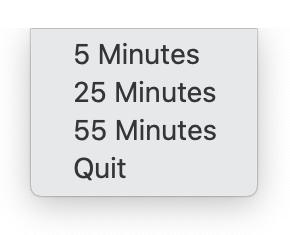

<h1>
   
   Opinionated Timer
</h1>

I'm a timer "menulet" with a restricted set of functionality. There are other
timers around that have fancy bells and whistles, but I'm basic. I can only set
timers for 5, 25, or 55 minutes. This may seem limiting, but if you allow me to
shift your perspective a bit, then you may find it rewarding.

The core concept I embody is the [Pomodoro Technique]. It's simple: once you
decide on a task to accomplish, set me for 25 or 55 minutes, then do some
diligent work. When I ring, you take a short 5 minute break. Rinse and repeat
until you're done with the task, taking longer breaks at some intervals. By
committing yourself to an amount of time dedicated for productivity, you will
be less tempted to be allow yourself to be distracted.

## Usage

Once I'm installed, you'll find me in your top right menu bar among other handy items:

Where you can choose a time interval: 

When the time's up, I'll let you know:

## Installation

Options:

1. Download the app from GitHub releases,
   [here (zip)](https://github.com/zkokaja/opinionated-timer/releases/latest/download/OpinionatedTimer.zip).
2. Build with XCode then go to Product -> Archive to get a `.app` file.

## Developer

The code is very simply and self explanatory. The main functionality comes
from the [User Notifications] developer library.

## Attribution
<a href="https://www.freepik.com/icon/tomato_676503">Icon by Freepik</a>

[Pomodoro Technique]: https://en.wikipedia.org/wiki/Pomodoro_Technique
